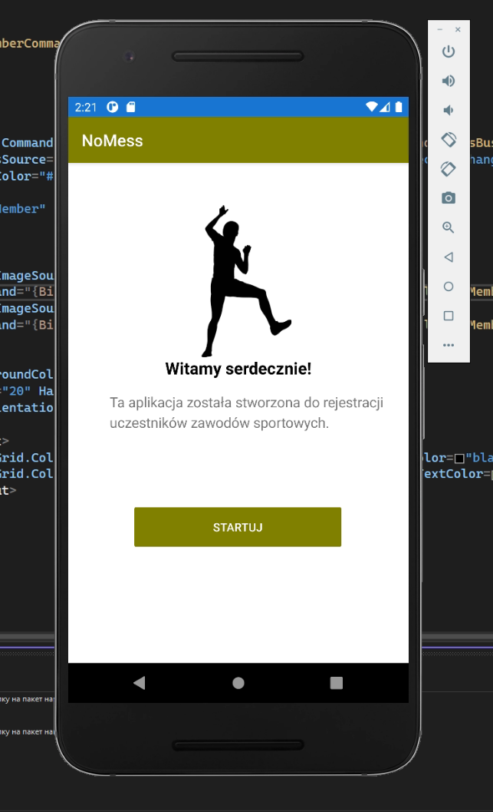
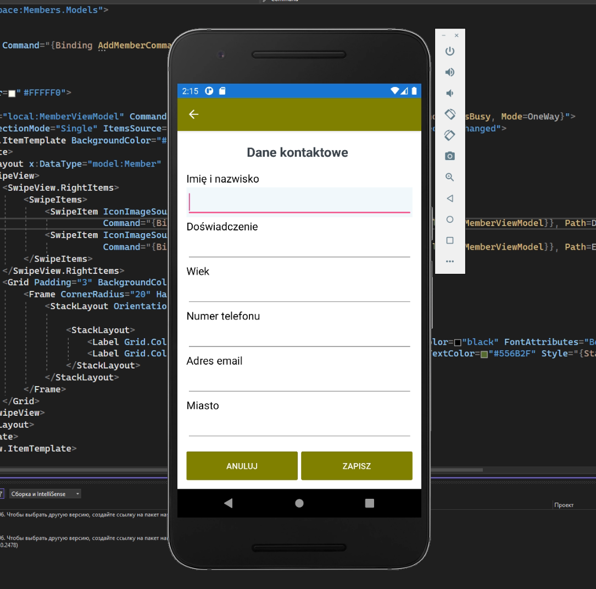
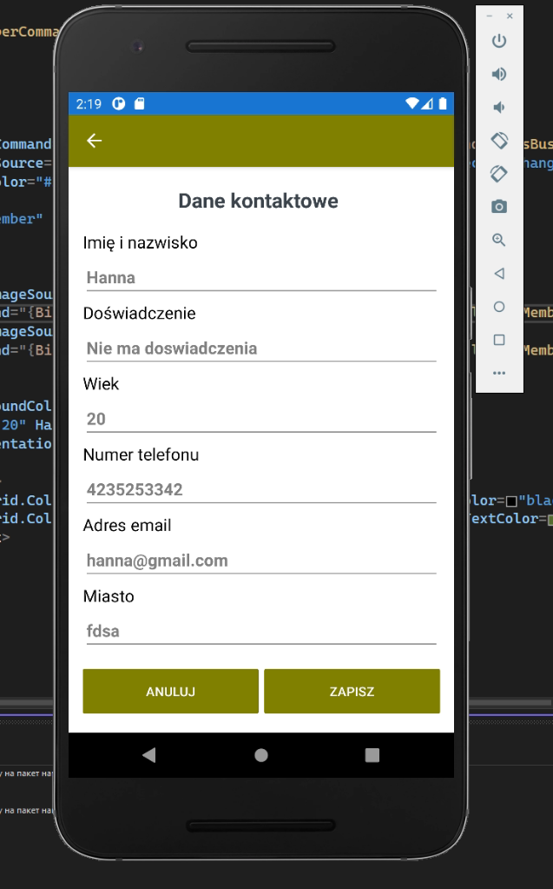
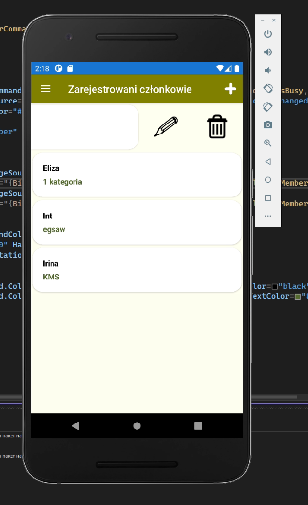
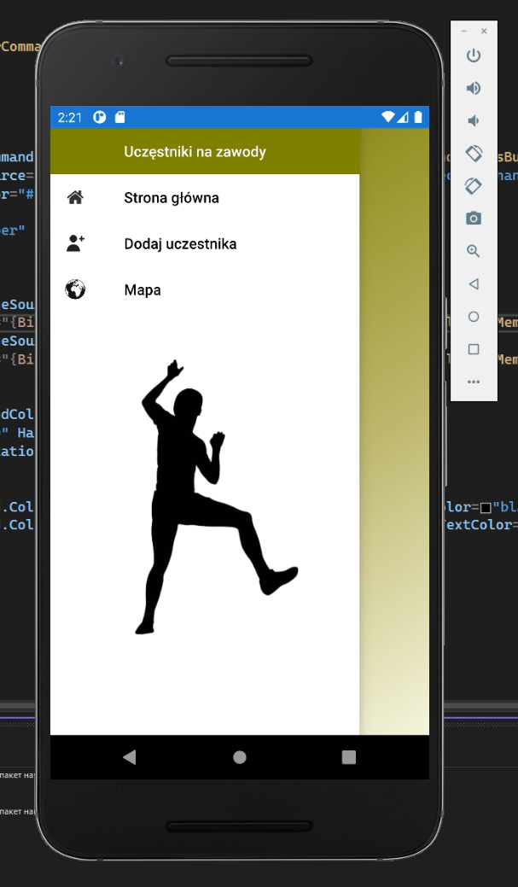
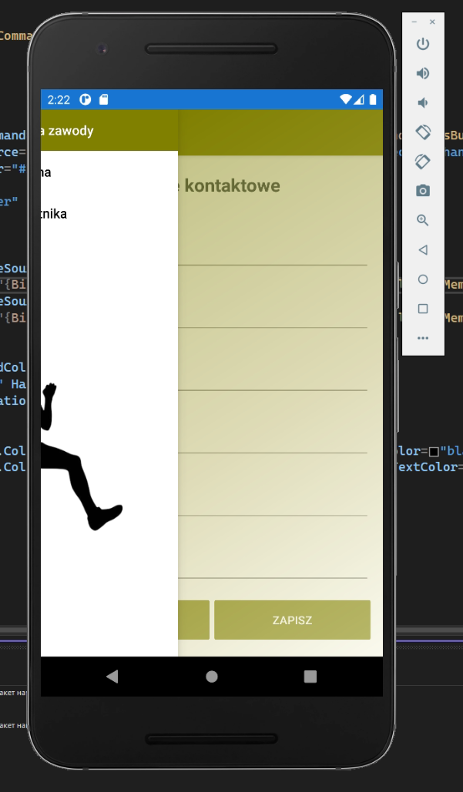

# Создано c помощью Xamarin.Forms
### Приложение Nomess создано для регистрации участников на соревнования.
### Тут можно зарегистрировать, отредактировать и удалить участника.
### Все данные хранятся в базе sql
### Так же в приложении разработана карта, где в дальнейшем будет возможность отметки своего маршрута
#### Главная страница

#### Форма добавления участника

#### В данной форме необходимо правильно заполнить все поля. При пустом поле, слишком короткого или длинного текста будет выведен коммуникат о ошибке.

#### Редактирование участника

#### Отредактировать или удалить можно с помощью свайпа

#### Меню

#### При выдвигании меню можно увидеть полупрозрачный градиент

### O nas

